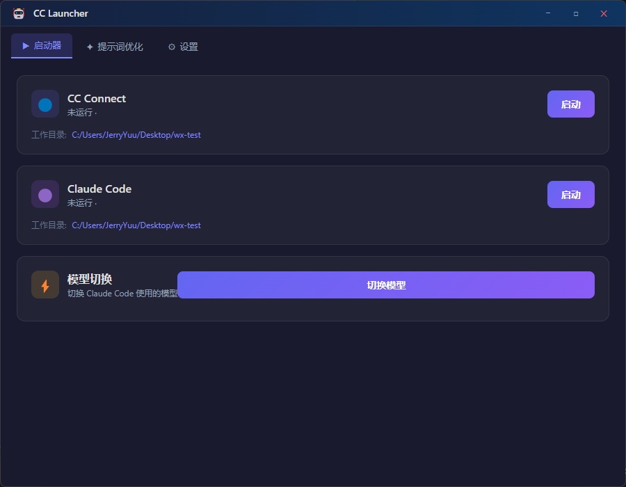

# CC Launcher

一个基于 Electron + React + TypeScript 的 AI 助手桌面工具，提供常用 AI 工具的快捷启动和提示词优化功能。

## 功能

- **CC Connect 一键启停** — 快速启动/停止 CC Connect 服务
- **Claude Code 一键启停** — 快速启动/停止 Claude Code
- **模型切换** — 一键切换 Claude Code 使用的模型
- **提示词优化** — 内置 AI 优化提示词，支持通用提示词和生图提示词两种模式
- **多 AI 服务商** — 支持 DeepSeek、Kimi (Moonshot)、OpenAI 及自定义 API
- **配置导入导出** — 一键导出配置分享给他人使用

## 截图



## 开发

```bash
# 安装依赖
npm install

# 启动开发模式
npm run dev

# 构建
npm run build

# 打包为 Windows 安装包
npm run dist:win
```

## 技术栈

- Electron 28
- React 19 + TypeScript 5
- Vite 4

## 许可

MIT
